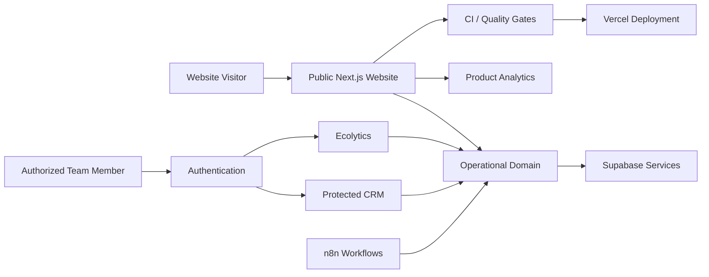

# ECORAIZ

> **Public project showcase.** The production source repository remains private because it contains operational business logic, infrastructure configuration and internal workflows.

## Overview

**ECORAIZ** is a PropTech platform designed to support a real-estate operation through a public commercial website and protected internal tools.

The platform combines a customer-facing web experience with CRM workflows, analytics, inventory-oriented domain logic, product telemetry and automation-ready operational processes.

**Live website:** https://ecoraiz.pe

## What the Platform Covers

- Public real-estate website
- Protected CRM workflows
- Internal analytics / **Ecolytics**
- Authentication and role/profile-aware access
- Inventory and operational-domain contracts
- Event tracking and product analytics
- Automation specifications
- Versioned database/infrastructure preparation
- Automated quality checks and browser tests
- Vercel-based deployment workflow

## Architecture

## Technology

| Area | Technologies |
|---|---|
| Frontend | Next.js · React · TypeScript · Tailwind CSS |
| Data & Auth | Supabase |
| Product Analytics | PostHog |
| Automation | n8n |
| Testing | Playwright · Domain Tests |
| Tooling | Turborepo · pnpm |
| Deployment | Vercel |
| Quality | ESLint · TypeScript · CI |

## Engineering Highlights

### Public + Internal Product Surfaces

The platform separates the public commercial website from authenticated operational capabilities. CRM and analytics functionality are not exposed as public demos.

### Access Control

Internal functionality is designed around authenticated sessions and authorized profiles instead of relying on hidden URLs.

### Product Analytics

The web platform supports event instrumentation and analytics to help understand acquisition and user behavior.

### Quality Gates

The private project uses automated checks for:

- linting
- type checking
- builds
- domain tests
- browser-based flows

### Operational Automation

Automation workflows are kept separate from public-facing functionality and are designed to support the real-estate operating model without exposing internal processes.

## Repository Strategy

This repository intentionally contains **documentation only**.

The production codebase stays private to avoid publishing:

- internal CRM logic
- operational workflows
- infrastructure details
- environment configuration
- business data
- authentication implementation details

## Portfolio Context

ECORAIZ demonstrates my work across **full-stack product architecture, PropTech, cloud services, authentication, analytics, automation and deployment engineering**.

---

**Private source repository · Public architecture showcase**
