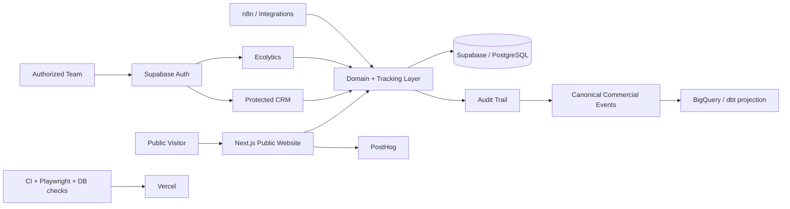

# ECORAIZ

### PropTech Platform · CRM · Analytics · Automation

**Public engineering showcase — production source remains private**

[Live website](https://ecoraiz.pe) · [Architecture](./docs/ARCHITECTURE.md) · [Project status](./docs/STATUS.md)

---

## Overview

**ECORAIZ** is a PropTech platform that combines a public real-estate website with protected internal tools for commercial operations and analytics.

The private platform is structured as a monorepo with a **Next.js public web application**, protected **CRM** workflows, **Ecolytics** analytics surfaces, Supabase-backed authentication/data services, product telemetry, automation preparation and CI-driven validation.

This repository intentionally documents the engineering work without exposing operational source code, customer data, credentials or internal business rules.

## Product Surfaces

| Surface | Purpose | Access |
|---|---|---|
| Public website | Commercial content, property discovery and public materials | Public |
| CRM | Leads, opportunities, activities, tasks, qualification and visits | Authenticated + authorized roles |
| Ecolytics | Commercial/analytics access and reporting entry point | Authenticated + authorized roles |
| Operational data layer | Security, CRM, audit, inventory and tracking schemas | Server / policy controlled |
| Automation layer | Operational workflow specifications and integrations | Private |

## Architecture

[Read the detailed architecture →](./docs/ARCHITECTURE.md)

## Implemented Engineering Scope

### Authentication & Authorization

- Supabase authentication flow for protected areas.
- Role/profile-aware access to CRM and Ecolytics.
- Row Level Security for operational data.
- MFA/TOTP support for privileged workflows.
- Session renewal and server-side access checks.
- No privileged service-role key is exposed to the browser.

### CRM Domain

The private implementation includes operational workflows for:

- contacts
- leads
- opportunities
- consent
- qualification
- visits
- notes
- loss/maturation/reactivation
- tasks
- manual assignment and reassignment
- audit history

### Analytics & Event Design

Commercial milestones are projected into canonical events designed to exclude free-text PII. The architecture prepares those events for ingestion into **BigQuery** and transformation with **dbt**.

### Quality Engineering

The private repository contains automated validation around:

- linting and TypeScript
- application builds
- domain tests
- PostgreSQL/RLS checks
- backup/restore verification
- artifact integrity
- PostHog privacy behavior
- browser flows with Playwright
- responsive/accessibility behavior

A documented technical review recorded **116 database checks**, successful logical restore validation and passing browser/domain quality gates in the reviewed environment.

## Technology

| Area | Technologies |
|---|---|
| Frontend | Next.js · React · TypeScript · Tailwind CSS |
| Data & Auth | Supabase · PostgreSQL · RLS · MFA/TOTP |
| Analytics | PostHog · BigQuery · dbt · Metabase integration path |
| Automation | n8n |
| Testing | Playwright · Node test runners · SQL/RLS tests |
| Monorepo | Turborepo · pnpm |
| Deployment | Vercel |
| CI | GitHub Actions |

## Engineering Decisions

**Public and operational surfaces are separated.** A public route is not treated as an access-control boundary.

**Authorization lives in data policies and server checks.** Commercial roles are not trusted from editable user metadata.

**Analytics is designed around canonical events.** The event projection avoids propagating names, phone numbers, emails, notes or free-text evidence into the analytical stream.

**Demo state is not presented as production state.** The private documentation explicitly separates implemented software, local verification and integrations that still require approved production accounts or environments.

## Current Status

The platform contains substantial implemented application and data-layer work, but not every integration is production-connected. Inventory transaction flows, some automation, warehouse ingestion and external operational services still depend on additional implementation or approved environment configuration.

[See the explicit implemented / pending matrix →](./docs/STATUS.md)

## Why the Source Is Private

The private repository contains:

- internal CRM workflows
- operational business rules
- infrastructure configuration
- authentication/security implementation
- migration history
- business data contracts
- deployment details

This showcase keeps the architecture reviewable without exposing those assets.

---

### What this project demonstrates

**Full-stack product architecture · PropTech · secure operational workflows · data governance · analytics engineering · automation · testing · cloud deployment**
