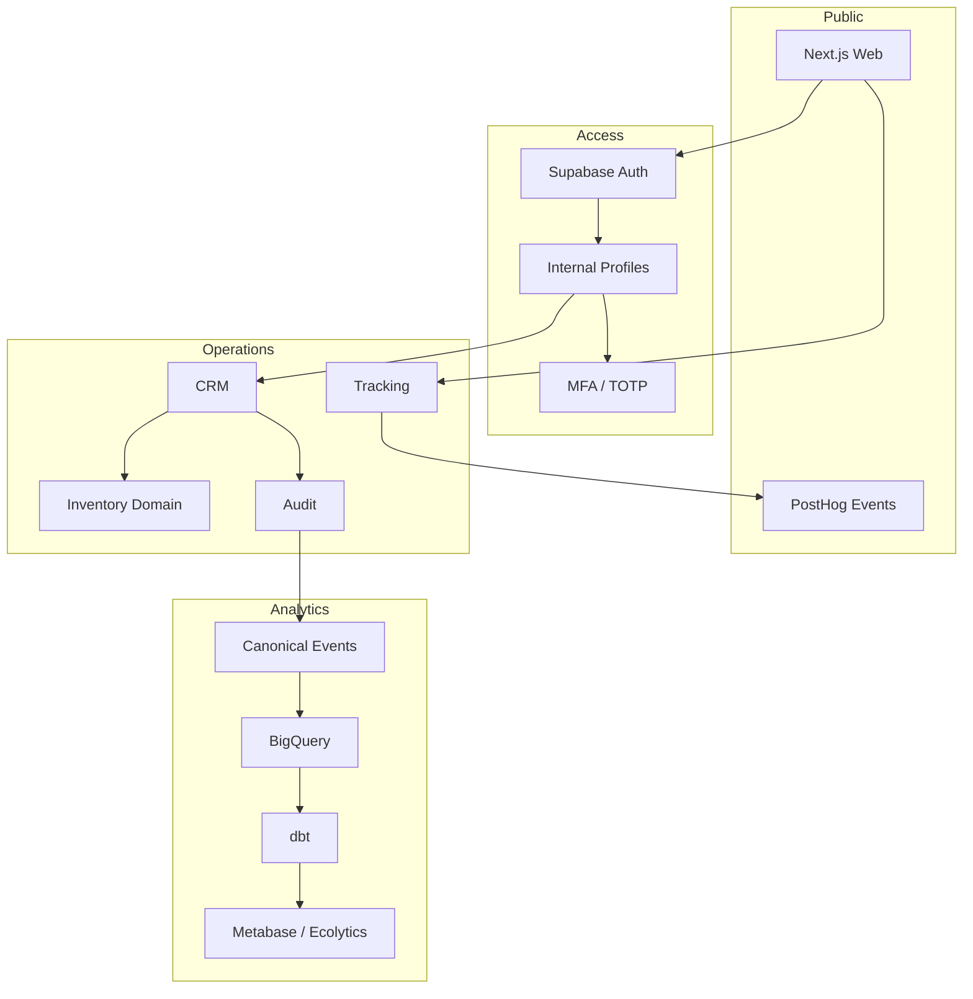

# ECORAIZ — Architecture

## 1. Architectural Goal

ECORAIZ is not only a public marketing site. The platform is designed as a layered product where public acquisition, authenticated commercial operations and analytical projection remain separated.

## 2. Main Layers

### Public web

The public surface is implemented with Next.js and contains commercial content, property discovery flows, attribution and public materials.

### Identity and access

Protected routes authenticate through Supabase Auth. CRM and Ecolytics access also requires an enabled internal profile.

The private implementation documents:

- HttpOnly session cookies
- SameSite=Lax
- Secure cookies in production
- server-side token renewal
- role/profile revalidation
- MFA/TOTP for privileged roles
- RLS-based data access

### CRM

The operational data model includes contacts, leads, opportunities, consent, qualification, visits, activities/tasks and assignment history.

### Audit and tracking

Operational events are audited. A separate canonical-event projection is intended for analytics and deliberately excludes direct PII/free-text fields.

### Analytics

The analytical direction is:

```text
Operational audit/events
        ↓
Canonical commercial events
        ↓
Approved ingestion identity
        ↓
BigQuery
        ↓
dbt staging / quality / cohort models
        ↓
BI / Ecolytics
```

The repository contains preparatory models and contracts; not every production analytics connection is active.

## 3. High-Level Diagram



## 4. Security Boundaries

- Browser code must not receive privileged Supabase keys.
- Authenticated routes re-check user/profile state.
- RLS is part of the authorization model.
- Privileged reassignment/management workflows require stronger authorization.
- Demo data and operational data are intentionally distinguished.
- Analytical events are designed to minimize PII propagation.

## 5. Validation Strategy

The private project uses multiple validation layers:

- lint / typecheck
- application build
- domain tests
- PostgreSQL and RLS tests
- backup and restore checks
- artifact integrity manifests
- PostHog behavior checks
- Playwright browser flows
- responsive/accessibility checks

This architecture documentation describes the private implementation at a portfolio-safe level; it is not a deployment guide.
