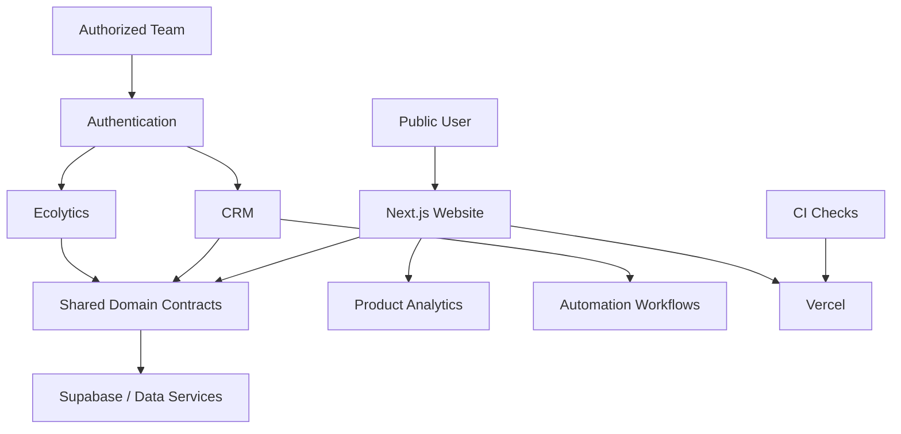

# ECORAIZ — Architecture Notes

## System Boundaries

The public showcase intentionally separates three surfaces:

1. **Public Website** — commercial discovery and customer-facing content.
2. **CRM** — authenticated operational workflows.
3. **Ecolytics** — authenticated analytics and reporting capabilities.

## Logical Flow

## Design Considerations

- Public and internal functionality are intentionally separated.
- Authentication protects operational functionality.
- Business data and infrastructure details are not published in this showcase.
- CI validates application quality before deployment.
- Product analytics are treated as a first-class part of the product architecture.
